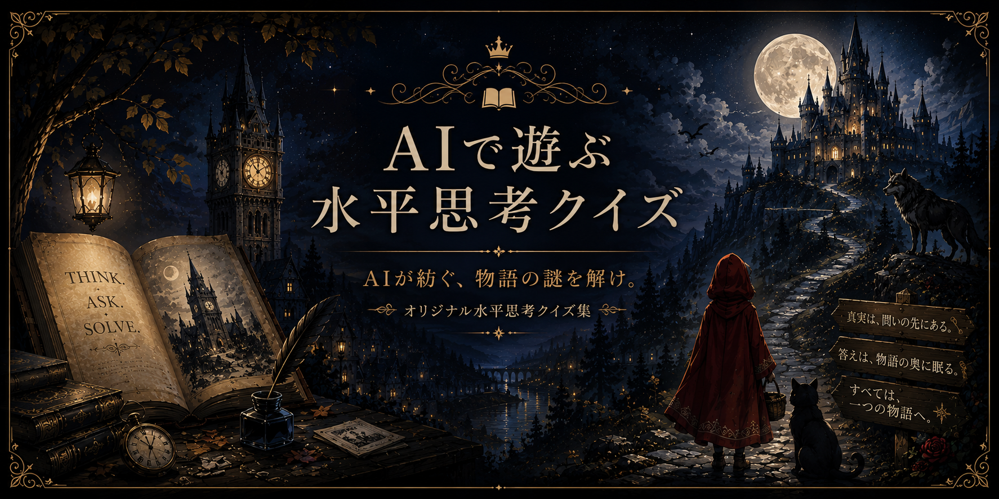

  

# AIで遊ぶ水平思考クイズ

> **AIと遊ぶ、新しい水平思考クイズ体験。**

このプロジェクトは、**AIをゲームマスターとして遊ぶ**ことを前提に制作した、オリジナル水平思考クイズ集です。

通常の問題集とは異なり、AIが問題を出題し、プレイヤーは「はい」「いいえ」「関係ありません」を頼りに真相を推理します。

------------------------------------------------------------------------

# 遊び方

1.  お使いのAIを開きます。
2.  プレイするAIに合わせて、次のどちらかのファイルを読み込ませます。
    -   **① ChatGPTで遊ぶ水平思考クイズ.md**（ChatGPT向け）
    -   **② AIで遊ぶ水平思考クイズ.md**（Claude・Geminiなど汎用）
3.  AIが作品一覧を表示します。
4.  好きな作品を選んで遊んでください。

------------------------------------------------------------------------

# プレイヤーへのお願い

⚠️ **作品ファイルには、すべての問題と解答が収録されています。**

ゲームとして楽しむため、**作品ファイルを開かず、そのままAIへ読み込ませる**ことをおすすめします。

------------------------------------------------------------------------

# 対応AI

-   ChatGPT（推奨）
-   Claude
-   Gemini
-   Grok
-   Copilot
-   その他、長文ファイルの読み込みに対応したAI

※AIによって挙動が異なる場合があります。

------------------------------------------------------------------------

# ファイル構成

-   ChatGPTで遊ぶ水平思考クイズ.md
-   AIで遊ぶ水平思考クイズ.md
-   README.md

------------------------------------------------------------------------

# 作者

**POP**

## 共同制作・AIサポート

**ユウ（ChatGPT）**

本作品は、作者とAIが共同で推敲・評価・改善を重ねながら制作しています。

------------------------------------------------------------------------

# 利用について

-   個人利用・プレイは歓迎します。
-   内容を紹介する際は、ネタバレへのご配慮をお願いします。
-   改変・派生作品・複製物の作成は、作者の意向を尊重してください。
-   作者本人と「ユウ」との共同制作は例外とします。

------------------------------------------------------------------------

# 更新

最新版は、このリポジトリをご確認ください。

楽しんでいただけたら、ぜひ感想やフィードバックをお寄せください。
